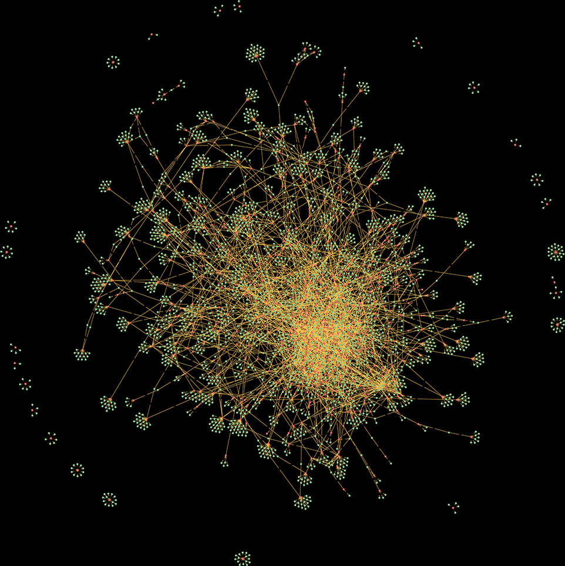
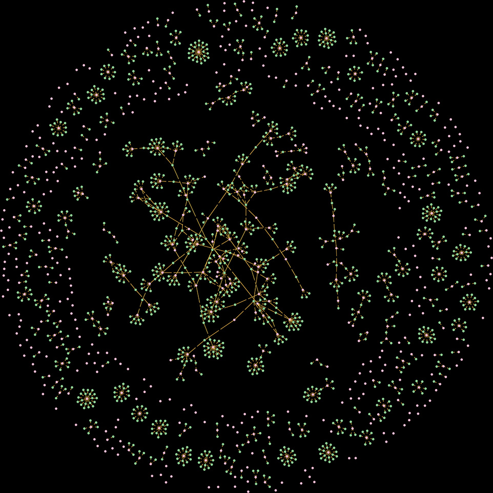

# گراف رابطه سهامداران حقیقی و حقوقی در بازار بورس ایران

|||
| :----------------------------: | :----------------------------: | :-----------------------------: 
|**همه سهامداران (بالای ۱ درصد)**  |**سهامداران حقیقی (بالای ۱ درصد)**|**سهامداران حقوقی (بالای ۱ درصد)**

##### [(English Version)](README.md)
بورس اوراق بهادار تهران، بازاری متشکل و خودانتظام است که اوراق بهادار در آن توسط کارگزاران یا معامله‌گران طبق قانون مورد دادوستد قرار می‌گیرد. بورس اوراق بهادار در قالب شرکت سهامی عام تأسیس و اداره می‌شود. در این بازار سهام شرکت‌های بسیاری از صنایع پتروشیمی، شیمیایی، بانکی و... عرضه شده است که هرکدام دارای سهامداران عمده‌ای هستند که به صورت حقیقی و حقوقی اطلاعات آنها در وب سایت [TSETMC](https://tsetmc.com/) قرار گرفته است. [(Wikipedia)](https://fa.wikipedia.org/wiki/%D8%A8%D9%88%D8%B1%D8%B3_%D8%A7%D9%88%D8%B1%D8%A7%D9%82_%D8%A8%D9%87%D8%A7%D8%AF%D8%A7%D8%B1_%D8%AA%D9%87%D8%B1%D8%A7%D9%86).

اطلاعات مربوط به سهامداران بالای یک درصد که سهامدار عمده نامیده می شوند به صورت عمومی منتشر شده و قابل دسترس است. ما در این پروژه تحقیقاتی، از این داده‌ها به منظور ایجاد گراف رابطه سهامداری با استفاده از ابزارهای حوزه علم داده‌ها و کلان داده شامل Apache Spark، MongoDB و Neo4j استفاده کردیم.

## سلب مسئولیت
در این پروژه از هیچ داده حساس سازمانی و خصوصی استفاده نشده است و فقط جنبه تحقیقاتی و پژوهشی دارد. افراد حاضر در این پروژه هیچ مسئولیتی در قبال سوء استفاده‌های احتمالی یا استفاده‌ تجاری نخواهند داشت و در صورت درخواست نهادهای ذی ربط، اطلاعات پروژه از دسترس خارج خواهد شد.

## نحوه کار

- وجود داده‌ها قبل از هر تحلیلی از اهمیت بسیاربالایی برخوردار است. به همین منظور داده‌های موردنیاز این پژوهش را از طریق کد پایتون موجود در پوشه `etl` جمع آوری می کنیم.
- این داده‌ها حاوی این اطلاعات هستند که چه کسانی با چه کد یکتایی سهامدار کدام سهم‌ها در بازار بورس ایران هستند. (لیست این شرکت‌ها را هم می توان از طریق کد موجود در پوشه `etl` جمع آوری کرد و هم لیست آماده آن‌ها در پوشه  `assets/ids`قرار گرفته است که برنامه قابلیت خواندن آن را دارد می باشد.)
- سپس این داده‌ها پالایش شده و از طریق کد مربوطه از پایگاه داده مانگو دی بی به پایگاه داده گرافی Neo4j انتقال می‌یابد. از این داده‌ها جهت ساخت گراف موردنظر و تحلیل آن استفاده خواهد شد.
- با استفاده از نرم افزار Neo4j Desktop و اجرای دستورات پرس و جوی Neo4j می توان گراف موردنظر را به صورت بصری مشاهده کرد. نتیجه را می توانید در تصاویر موجود در بالای این راهنما مشاهده نمایید. (خبر خوب اینکه ما خروجی این گراف بصری را در قالب‌های تصویری مختلفی آماده کردیم که می توانید از طریق پوشه  `assets/images`به آن دسترسی یابید.)
- با استفاده از الگوریتم‌های حوزه کلان داده و قابلیت‌های ابزار Apache Spark تحلیل‌هایی نظیر Connected Components و PageRank را برروی این گراف اجرا کردیم. نتایج تحلیل را در پوشه `results` قرار داده ایم. (کد برنامه مربوط به این تحلیل‌ها به زبان اسکالا در پوشه `explore` موجود می‌باشند.)
- ما می‌دانیم که تحلیل‌های بسیار بیشتری را می توان برروی این داده‌ها انجام داد. به همین دلیل خوشحال خواهیم شد تا مشارکت شما را در این پروژه داشته باشیم.

## تکنولوژی‌ها و ابزارهای استفاده شده

در این پروژه از ابزارها و نرم افزارهای حوزه علم داده و کلان داده‌های زیر استفاده شده است

- **Apache Spark** - Version: 3.3.2 (Dependency needed: jdk-17)
- **MongoDB** - Version: 6.0.8
- **Neo4j** - Version: 5.15-community (Dependency needed: jdk-17)
- **Neo4j Desktop** - Version: 1.5.9
- **Python** - Version: 3.10 (Dependency(modules) needed: pandas, neo4j, pymongo, requests.)
- **Scala** - Version: 2.12

## نحوه استفاده

قبل از اجرای دستورات، تنظیمات مربوط به اجرای برنامه که در فایل `config/config.ini` قرار دارد را تنظیم کنید. شرح هرکدام از آن‌ها به قرار زیر است:
- **[DEFAULT] بخش**
  - **ids_source** - برنامه برای کار به لیست شرکت‌ها نیاز دارد. با تنظیم این بخش برنامه می تواند این لیست را از فایل یا از سایت بخواند.
  - **ids_source_file_path** - آدرس فایل لیست شرکت‌ها
- **[MONGODB] بخش**
  - **mongodb_host** - نام میزبان پایگاه داده مانگو دی بی
  - **mongodb_port** - شماره پورت اتصال پایگاه داده مانگو دی بی 
  - **mongodb_username** - نام کاربر پایگاه داده مانگو دی بی
  - **mongodb_password** - رمزعبور پایگاه داده مانگو دی بی
  - **mongodb_dbname** - نام پایگاه داده مانگو دی بی
  - **mongodb_collection_name** - نام مجموعه یا جدول پایگاه داده مانگو دی بی
- **[NEO4J] بخش**
  - **neo4j_host** - نام میزبان پایگاه داده  Neo4j
  - **neo4j_port** - شماره پورت پایگاه داده  Neo4j
  - **neo4j_username** - نام کاربر پایگاه داده Neo4j
  - **neo4j_password** - رمز عبور پایگاه داده Neo4j


و سپس دستور زیر را در خط فرمان اجرا کنید:
```sh
cd etl
python fetch_shareholders_data.py
python etl_from_mongodb_to_neo4j.py
```

برای تحلیل با استفاده از الگوریتم‌های گراف موجود در ابزار کلان داده Apache Spark از دستور زیر استفاده نمایید:

```sh
cd explore
spark/bin/spark-shell -i spark_graphx_exploration.scala
```

## مجموعه داده نمونه

برای راحتی استفاده افرادی که نمی‌خواهند از تکنولوژی‌های موجود در این پروژه استفاده کنند، مجموعه داده نمونه‌ای شامل اطلاعات سهامداران مربوط به ۱۰۰ شرکت بورسی قرار گرفته است تا اگر علاقه داشتید در پروژه‌های خود از آن بهره ببرید. در صورت عدم کارکرد الگوریتم مربوط به جمع آوری داده‌ها، این مجموعه داده‌ها می توانند سودمند باشند.

## مشارکت و همکاری

ما تشنه مشارکت و همکاری هستیم! اگر دوست داشتید در این پروژه مشارکت کنید کافی است Fork کنید و ایده‌های جذاب خودتان را به این پروژه اضافه کنید.

## مجوز
CC BY-NC 4.0 (Attribution-NonCommercial 4.0 International).

هرگونه تغییر، توسعه، بازتولید و کاوش در این پروژه صرفا با هدف تحقیقاتی و پژوهشی با ذکر اسامی پدیدآورندگان و توسعه دهندگان آن مانعی ندارد.
