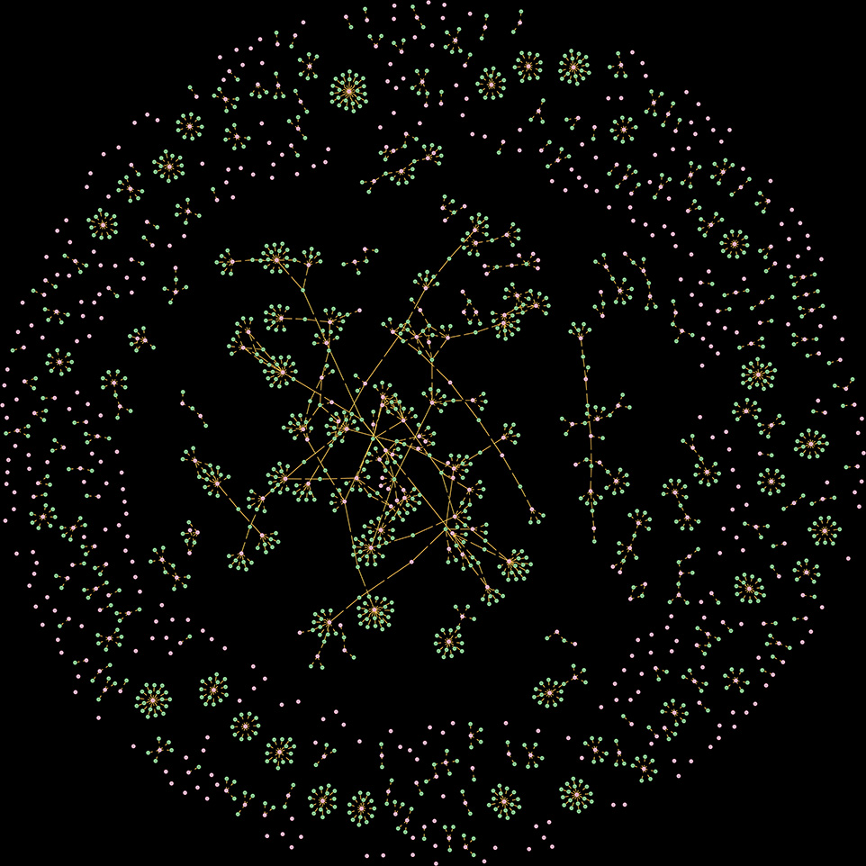
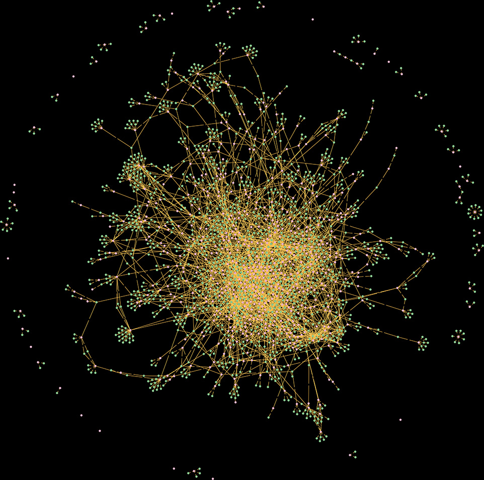

# Shareholding Relationship Graph of Tehran Stock Exchange

|||
| :----------------------------: | :----------------------------: | :-----------------------------: 
|**All Shareholders (Over 1%)**  |**Individual Shareholders (Over 1%)**|**Legal Entity Shareholders (Over 1%)**
##### [(نسخه فارسی)](README-fa.md)
The Tehran Stock Exchange (TSE) is Iran's largest stock exchange, which first opened in 1967. As of May 2023, 666 companies with a combined market capitalization of US$1.45 trillion were listed on TSE. Iran's capital market has companies from a wide range of industries,including automotive, telecommunications, agriculture, petrochemical, mining, steel iron, copper, banking and insurance, banking and others. Many of the companies listed are state-owned firms that have been privatized [(Wikipedia)](https://en.wikipedia.org/wiki/Tehran_Stock_Exchange).

Each company that is registered in TSE have their own (individual/legal entity) shareholders that you can access the information about them publicly on [TSETMC](https://tsetmc.com/) website. In this project, I used this data to build the relationship graph of shareholders using data science and big data tools e.g. Apache Spark (GraphX lib), MongoDB, Neo4j.

## DISCLAIMER
The author of this project **DID NOT** use any **confidential, private or leaked data** in the market and It is not responsible for the misuse of it. This project has been developed only for **research purposes** and the owner of the data has its rights to request for deletion.

## What was done

- Data is everything. So we gathered some data about shareholders on the website mentioned above. (You can find the code and sample datasets on `etl` and `datasets` folders.)
- The data explained us that who are the shareholders of a company. (The list of companies and its information we need, can also be gathered. For ease of use, a file named `ownership_ids.txt` in `assets/ids` folder includes these information.)
- We extracted, transformed and loaded the data from MongoDB database and build the graph on Neo4j to have our data and explore it in the graph shape.
- With the help of Neo4j Desktop, we ran some cypher queries to visualize the graph itself. The result was amazing that you can see it in the pictures above. (Good News: We exported the graph into SVG, JPG and PNG format that you can find them in `assets/images` folder. Do not forget to change the default configuration of Neo4j Desktop to see the full graph. The configuration is `:config initialNodeDisplay: 100000`.)
- We also have done some graph analysis with the help of Apache Spark including `Connected Componenets` and `PageRank` and we saved the results in `results` folder. (The source code of these analysis is in `explore` folder and It has been written in Scala language.)
- I know you can do more analysis in this area and We will be happy to have your contributions.

## Technology

In this project, We used a number of data science and big data tools following below:

- **Apache Spark** - Version: 3.3.2 (Dependency needed: jdk-17)
- **MongoDB** - Version: 6.0.8
- **Neo4j** - Version: 5.15-community (Dependency needed: jdk-17)
- **Neo4j Desktop** - Version: 1.5.9
- **Python** - Version: 3.10 (Dependency(modules) needed: pandas, neo4j, pymongo, requests.)
- **Scala** - Version: 2.12

## How to Use

Install the softwares mentioned above and start from here. (Notice that is assumed that you ran all the daemons and everything is ready to use. If you have any problems, open an issue and ask us.)

Before running it, you have to change the config in `config/config.ini` file. The properties in this file is following below:
- **[DEFAULT] Section**
  - **ids_source** - It tells the program where to read the list of companies. (Options: file[Default], tsetmc.)
  - **ids_source_file_path** - The path of file.
- **[MONGODB] Section**
  - **mongodb_host** - MongoDB hostname/address.
  - **mongodb_port** - MongoDB port number.
  - **mongodb_username** - MongoDB database user.
  - **mongodb_password** - MongoDB database password.
  - **mongodb_dbname** - MongoDB database name.
  - **mongodb_collection_name** - MongoDB collection name.
- **[NEO4J] Section**
  - **neo4j_host** - Neo4j hostname/address.
  - **neo4j_port** - Neo4j port number.
  - **neo4j_username** - Neo4j database user.
  - **neo4j_password** - Neo4j database password.

And then:
```sh
cd etl
python fetch_shareholders_data.py
python etl_from_mongodb_to_neo4j.py
```

For Big Data analysis like Connected Components and PageRank:

```sh
cd explore
spark/bin/spark-shell -i spark_graphx_exploration.scala
```

## Sample Datasets

For ease of use and have your ideas in this project not only for these technologies, but also another tools you preferred to use, we exported a sample of 100 companies and their shareholders data for you in CSV and XLSX format that you can find them in `datasets` folder. In case of any issues about crawling the data, these samples are profitable to explore.

## Contribution

Want to contribute? Great. Any sort of contribution is welcome! Just fork the project and do your contributions and let others see what you have done.

## License
CC BY-NC 4.0 (Attribution-NonCommercial 4.0 International). This license requires that reusers give credit to the creator. It allows reusers to distribute, remix, adapt, and build upon the material in any medium or format, for noncommercial purposes only. 
